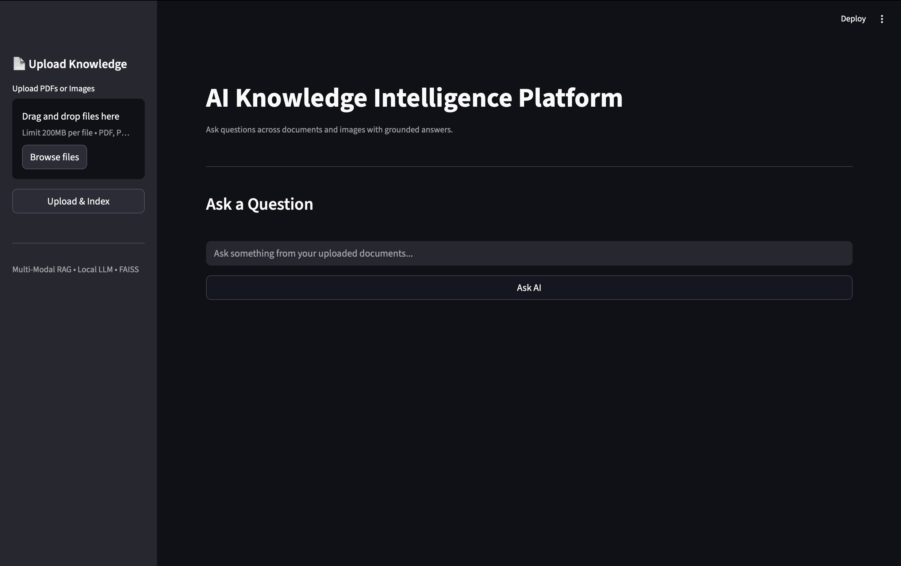
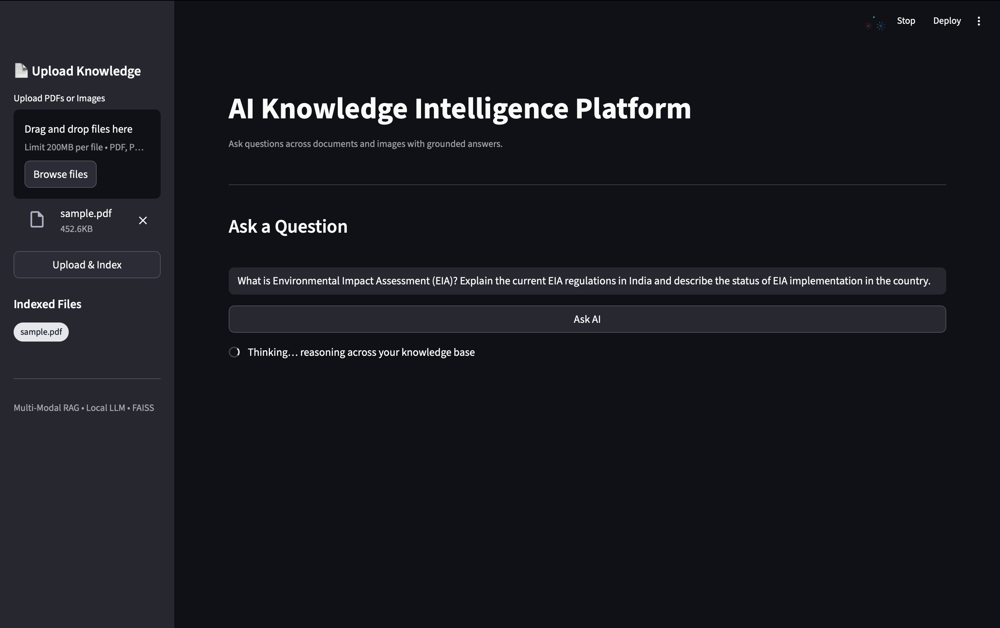
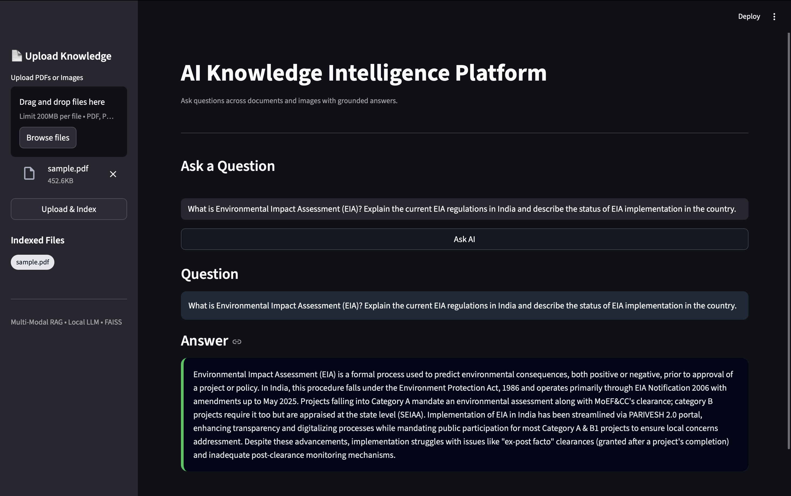

#  AI Knowledge Intelligence Platform  
### Multi-Modal Retrieval-Augmented Generation (RAG) with Local LLMs

An advanced **AI Knowledge Intelligence Platform** that allows users to upload **documents (PDFs)** and **images** and ask **natural-language questions**, receiving **grounded, context-aware answers** using **multi-modal RAG**, **vector search**, and a **local Large Language Model**.

This system runs **fully locally** — no OpenAI keys, no paid APIs — demonstrating **real-world AI system design** used in modern production environments.

## Core Capabilities

- Upload PDF documents  
- Upload images / scanned documents  
- Ask natural-language questions  
- Semantic search across text & images  
- Local LLM inference (Phi-3 via Ollama)  
- High-performance vector search using FAISS  
- Modern AI chat-style UI  
- Fully local, offline & privacy-preserving  

---

##  AI Techniques Used

### 🔹 Retrieval-Augmented Generation (RAG)
- Retrieves relevant chunks from documents and images
- Injects them into the LLM prompt
- Prevents hallucinations
- Produces grounded, accurate answers

### 🔹 Multi-Modal Embeddings
- Text embeddings → SentenceTransformers
- Image embeddings → CLIP
- Enables cross-modal reasoning (text ↔ images)

### 🔹 Local LLM Inference
- Uses Phi-3 via Ollama
- Zero cloud dependency
- Low latency
- Data never leaves the system

---

## Example Queries

- "Explain inter-basin water transfer"
- "Summarize disease symptoms shown in the image"
- "What are the environmental impacts discussed in this PDF?"
- "Link the diagram with document recommendations"

---

## Privacy & Offline-First Design

- No cloud APIs
- No data leakage
- Fully local execution
- Suitable for healthcare, legal, and enterprise environments

---
## 📸 Screenshots

### Upload Knowledge

### Ask a Question

### AI Answer

