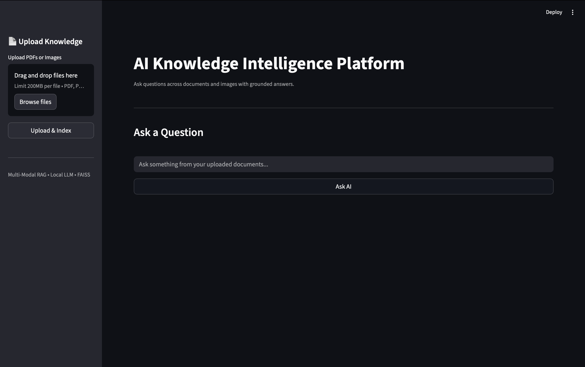
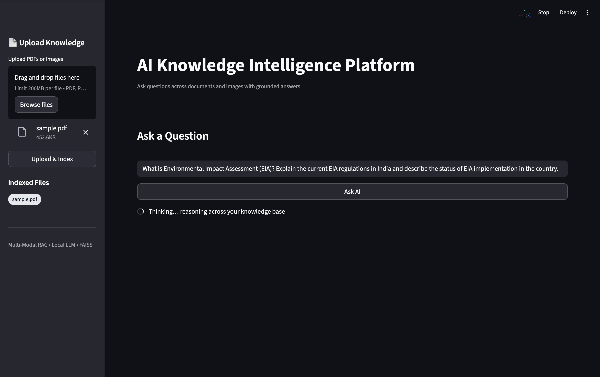
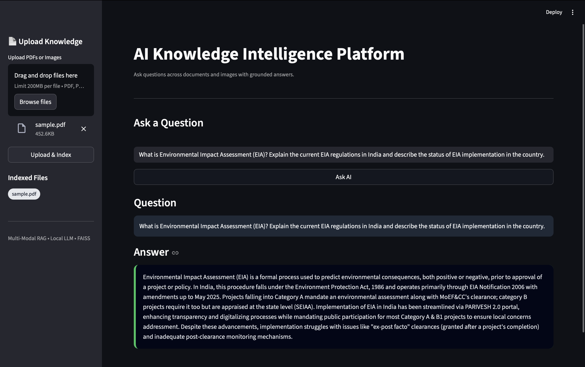

# 🧠 ContextIQ

### Multi-Modal Retrieval-Augmented Generation (RAG) with Local LLMs

*An AI Knowledge Intelligence Platform that turns your PDFs and images into a grounded, conversational knowledge base — fully offline, fully private.*

---

## 🌟 Overview

**ContextIQ** is an advanced **AI Knowledge Intelligence Platform** that lets users upload **documents (PDFs)** and **images**, then ask **natural-language questions** and receive **grounded, context-aware answers** — powered by **multi-modal RAG**, **vector search**, and a **local Large Language Model**.

The entire system runs **100% locally** — no OpenAI keys, no paid APIs, no data leaving your machine — demonstrating real-world AI system design patterns used in modern production environments.

---

## ✨ Core Capabilities

| | |
|---|---|
| 📄 | **PDF Upload** — Ingest and index document knowledge |
| 🖼️ | **Image Upload** — Support for images and scanned documents |
| 💬 | **Natural-Language Q&A** — Ask questions the way you'd ask a person |
| 🔍 | **Semantic Search** — Cross-modal retrieval across text & images |
| 🤖 | **Local LLM Inference** — Phi-3 via Ollama, zero cloud dependency |
| ⚡ | **High-Performance Vector Search** — FAISS-powered retrieval |
| 🎨 | **Modern Chat UI** — Clean, AI-assistant-style interface |
| 🔒 | **Fully Offline & Private** — No data ever leaves the system |

---

## 🧬 AI Techniques Used

### 🔹 Retrieval-Augmented Generation (RAG)
- Retrieves relevant chunks from documents and images
- Injects them into the LLM prompt
- Prevents hallucinations
- Produces grounded, accurate answers

### 🔹 Multi-Modal Embeddings
- **Text embeddings** → SentenceTransformers
- **Image embeddings** → CLIP
- Enables cross-modal reasoning (text ↔ images)

### 🔹 Local LLM Inference
- Uses **Phi-3** via **Ollama**
- Zero cloud dependency
- Low latency
- Data never leaves the system

---

## 💡 Example Queries

> 🗨️ *"Explain inter-basin water transfer"*
> 🗨️ *"Summarize disease symptoms shown in the image"*
> 🗨️ *"What are the environmental impacts discussed in this PDF?"*
> 🗨️ *"Link the diagram with document recommendations"*

---

## 🔐 Privacy & Offline-First Design

| Guarantee | Status |
|---|---|
| Cloud APIs | ❌ None |
| Data Leakage | ❌ None |
| Local Execution | ✅ Fully Local |
| Enterprise-Ready | ✅ Healthcare, Legal & Enterprise Suitable |

---

## 📸 Screenshots

### 📤 Upload Knowledge

### ❓ Ask a Question

### 💡 AI Answer

---

**Built for private, grounded, multi-modal AI reasoning — entirely on your own machine.**

Made with 🧠 + 🔒 by [Pavan Bendre R](https://github.com/pavanbr593)

